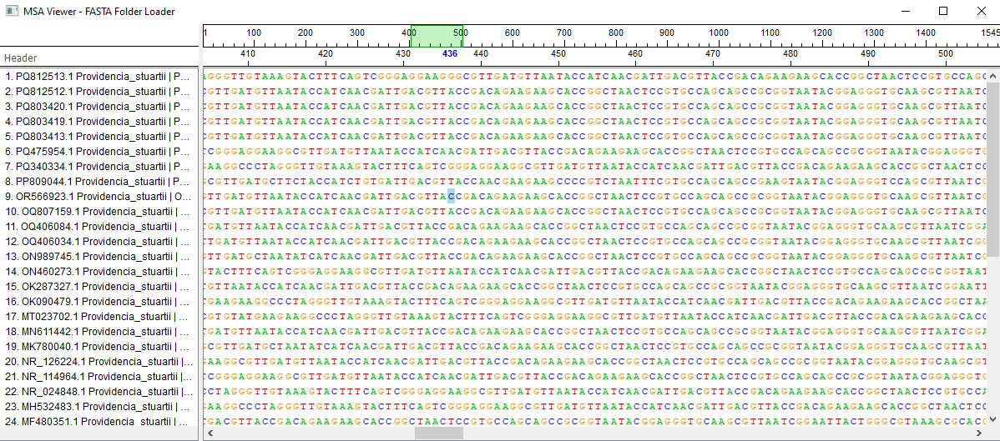
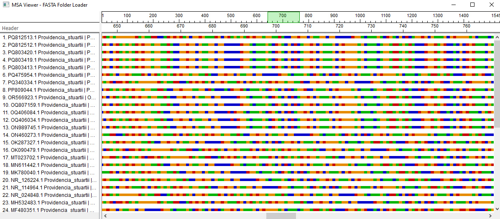
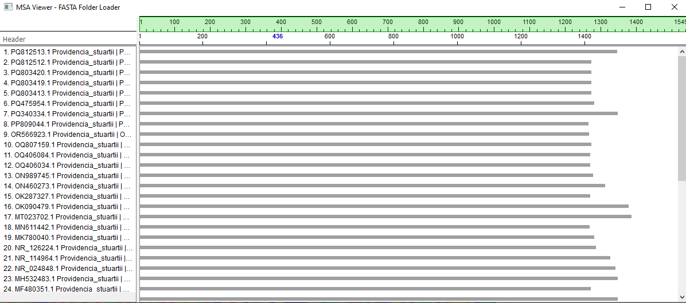

# MSA Sequence Viewer

---

## Overview

MSA Sequence Viewer is a desktop application for visualizing and navigating large multiple sequence alignments. Designed to handle genomic-scale FASTA files with smooth, responsive interaction — featuring adaptive level-of-detail rendering, glyph caching, and viewport-aware painting for consistent 60+ FPS performance.

> 🚧 **Work in Progress** — Core features are functional. Active development ongoing.

---

## Screenshots

<p align="center">
  
  <br><em>Text mode — individual nucleotides with color-coded bases (A/T/C/G)</em>
</p>

<p align="center">
  
  <br><em>Adaptive LOD: TEXT → BOX → LINE mode transitions at different zoom levels</em>
</p>
<p align="center">
  
  <br><em>Adaptive LOD: TEXT → BOX → LINE mode transitions at different zoom levels</em>
</p>

---

## Key Features

### 🔬 Adaptive Level-of-Detail Rendering

The viewer automatically switches between three display modes based on zoom level:

| Mode | Trigger | Rendering |
|------|---------|-----------|
| **TEXT** | `font_size ≥ 8.0` | Individual nucleotide characters with color-coded glyphs |
| **BOX** | `font_size ≥ 5.0` | Colored rectangles per base — readable at medium zoom |
| **LINE** | `font_size < 5.0` | Thin horizontal line — overview of full sequence length |

Thresholds are defined in `SequenceItemModel` and transitions are seamless during zoom animation.

### ⚡ Performance Optimizations

- **Viewport-aware painting**: Only visible nucleotides are drawn (`exposedRect` clipping), not the entire sequence
- **Glyph cache**: Pre-rendered character pixmaps (`GlyphCache`) eliminate repeated font rasterization — keyed by `(char, font_family, size, bold, italic, r, g, b)`
- **Ruler pixmap cache**: Navigation ruler tick marks and labels are rendered once to a `QPixmap` and composited with viewport overlay
- **Pen caching**: Reusable `QPen`/`QBrush` class-level constants avoid per-frame object creation
- **LRU-style LOD override**: `set_lod_max_mode()` allows forced downgrade without recalculating zoom state

### 🔍 Zoom & Navigation

- **Smooth zoom animation**: `QVariantAnimation` with `OutCubic` easing (180ms duration)
- **Streak acceleration**: Consecutive Ctrl+Wheel events progressively increase zoom speed (`base_factor=1.22`, `accel_factor=1.06` per streak)
- **Smart pivot**: Zoom centers on selection midpoint if active, otherwise on mouse cursor position
- **Navigation minimap**: Top ruler shows full sequence extent with green viewport indicator — click to center, drag to zoom to range
- **Position ruler**: Tick labels dynamically adjust spacing based on visible span, with bold blue highlights for selected positions

### 📋 Selection System

- **Click + drag** across rows and columns for rectangular selection
- **Bidirectional sync**: Selection state propagates from `SequenceViewerModel` → `SequenceViewerView` → `SequencePositionRulerWidget`
- **Selection-aware zoom**: Pivot automatically uses selection center for stable zoom experience
- **Visual highlight**: Light blue overlay (`QColor(173, 216, 230)`) on selected cells

### 📐 Resizable Header Panel

- **Splitter-based layout**: Adjustable header/sequence panel ratio
- **Auto-width**: `compute_required_width()` calculates pixel-perfect maximum based on longest header text
- **Elided text**: Headers that don't fit are automatically truncated with "..." (`Qt.ElideRight`)
- **Vertical scroll sync**: Header panel and sequence panel scroll bars are bidirectionally synchronized

---

## Architecture

The project follows a consistent **CMV (Controller-Model-View)** pattern across all modules:

```
msa_viewer/
│
├── main.py                              # Application entry point
│
├── model/
│   └── sequence_data_model.py           # Global data model (FASTA loading)
│
├── features/
│   ├── sequence_viewer/                 # Core sequence display
│   │   ├── sequence_viewer_model.py     # Sequence data + selection state
│   │   ├── sequence_viewer_view.py      # QGraphicsView + zoom animation
│   │   ├── sequence_viewer_controller.py # Mouse/wheel events + zoom logic
│   │   └── sequence_viewer_widget.py    # Public facade (Model+View+Controller)
│   │
│   ├── header_viewer/                   # Sequence name panel
│   │   ├── header_viewer_model.py       # Header string storage
│   │   ├── header_viewer_view.py        # QGraphicsView + HeaderRowItems
│   │   ├── header_viewer_widget.py      # Public facade
│   │   └── header_spacer_widgets.py     # Ruler-height spacers for alignment
│   │
│   ├── navigation_ruler/               # Top minimap ruler
│   │   ├── navigation_ruler_model.py    # Max-len cache, tick layout, x→nt mapping
│   │   └── navigation_ruler_widget.py   # QPainter + pixmap cache + mouse interaction
│   │
│   └── position_ruler/                 # Zoom-synced position ruler
│       ├── position_ruler_model.py      # Visible range, step selection, selection positions
│       └── position_ruler_widget.py     # QPainter + tick/label rendering
│
├── graphics/
│   ├── sequence_item/                   # Single sequence row rendering
│   │   ├── sequence_item.py             # QGraphicsItem (TEXT/BOX/LINE paint)
│   │   ├── sequence_item_model.py       # Zoom state, display mode, selection range
│   │   └── sequence_glyph_cache.py      # Pixmap cache + nucleotide color map
│   │
│   └── header_item/                     # Single header row rendering
│       ├── header_item.py               # QGraphicsItem (elided text paint)
│       └── header_item_model.py         # Text, padding, font size logic
│
├── widgets/
│   └── workspace.py                     # Main layout (Splitter + sync)
│
├── settings/
│   ├── config.py                        # Pydantic-based config (env + user + defaults)
│   ├── color_palette.py                 # Color management with persistence
│   └── showing_modes.py                 # Immutable display mode presets
│
├── repositories/
│   ├── base_repository.py               # Abstract interface (Protocol-based)
│   ├── file_based_repository.py         # FASTA + feature file backend
│   ├── database_repository.py           # Placeholder DB backend
│   └── repository_factory.py            # Config-driven instantiation
│
└── data/
    └── default_settings.json            # Default color palette + display modes
```

### Design Decisions

**Why CMV instead of MVC?**
Each module separates concerns as Controller-Model-View where the Controller mediates between Model (pure data/state) and View (pure rendering). The Widget class serves as a facade that wires them together and exposes a clean public API. This keeps each layer independently testable.

**Why QGraphicsView instead of QWidget + QPainter?**
`QGraphicsView` provides built-in scene management, viewport culling, and coordinate transformation — critical for handling sequences with millions of nucleotides without custom virtual scrolling.

**Why glyph caching?**
At TEXT mode with thousands of visible characters, calling `QPainter.drawText()` per character is expensive. Pre-rendering each unique `(char, font, color)` combination to a `QPixmap` and using `drawPixmap()` reduces paint time by ~70%.

---

## Configuration

The application uses a layered configuration system with Pydantic:

```
Priority (highest → lowest):
1. Environment variables (SEQUENCE_VIEWER_*)
2. User config (~/.sequence_viewer/config.json)
3. Default settings (data/default_settings.json)
```

### Color Palette

```json
{
  "color_palette": {
    "background": "#0B0C10",
    "foreground": "#C5C6C7",
    "highlights": {
      "feature_gene": "#45A29E",
      "feature_exon": "#66FCF1",
      "selection": "#1F2833"
    }
  }
}
```

### Display Modes

Three pre-configured visualization modes: `alignment`, `coverage`, and `variant` — each with customizable visible components, line thickness, and additional parameters.

---

## Repository Pattern

Data access is abstracted through the repository pattern:

```python
# Abstract interface
class AbstractSequenceRepository(ABC):
    def get_sequence_by_id(self, sequence_id: str) -> SequenceRecord
    def list_sequences(self) -> Iterable[SequenceRecord]
    def get_features_in_region(self, sequence_id, start, end) -> Iterable[...]
    def save_sequence(self, sequence: SequenceRecord) -> None

# Implementations
FileBasedRepository   # FASTA + BED/VCF files
DatabaseRepository    # Placeholder for future DB integration

# Factory
RepositoryFactory(config).create_repository()  # Config-driven instantiation
```

This allows swapping data backends (local files → database → API) without touching UI code.

---

## Getting Started

```bash
# Clone repository
git clone https://github.com/aquamarin97/msa-sequence-viewer.git
cd msa-sequence-viewer

# Install dependencies
pip install -r requirements.txt

# Run with a FASTA directory
python main.py
```

### Requirements

```
PyQt5>=5.15
BioPython>=1.80
pydantic>=1.10
```

---

## Roadmap

- [x] Core sequence rendering (TEXT/BOX/LINE modes)
- [x] Smooth zoom with animation and streak acceleration
- [x] Navigation minimap with drag-to-zoom
- [x] Position ruler with dynamic tick spacing
- [x] Rectangular selection with visual highlight
- [x] Resizable header panel with elided text
- [x] Pydantic-based configuration system
- [x] Repository pattern for data abstraction
- [ ] Consensus sequence display
- [ ] Feature annotation overlay (GFF/BED)
- [ ] Search/find nucleotide pattern
- [ ] Export selection to FASTA/clipboard
- [ ] Dark theme support
- [ ] Alignment coloring schemes (ClustalX, Zappo, etc.)
- [ ] Gap analysis and statistics panel
- [ ] Command-line arguments for file input

---

## Tech Stack

| Category | Technologies |
|----------|-------------|
| **Language** | Python 3.10+ |
| **GUI Framework** | PyQt5, QGraphicsView |
| **Bioinformatics** | BioPython (SeqIO) |
| **Configuration** | Pydantic (BaseSettings) |
| **Rendering** | QPixmap glyph cache, viewport-aware QPainter |
| **Architecture** | CMV pattern, Repository pattern, Factory pattern |

---

## Author

**Mustafa Necati Haşimoğlu** — Bioengineer | Computational Biologist

📫 [mustafanecati184@gmail.com](mailto:mustafanecati184@gmail.com)
🔗 [LinkedIn](https://www.linkedin.com/in/mustafa-necati-haşimoğlu-4b4936223) | [Upwork](https://www.upwork.com/freelancers/~0194e609aca8e35e26)

---
